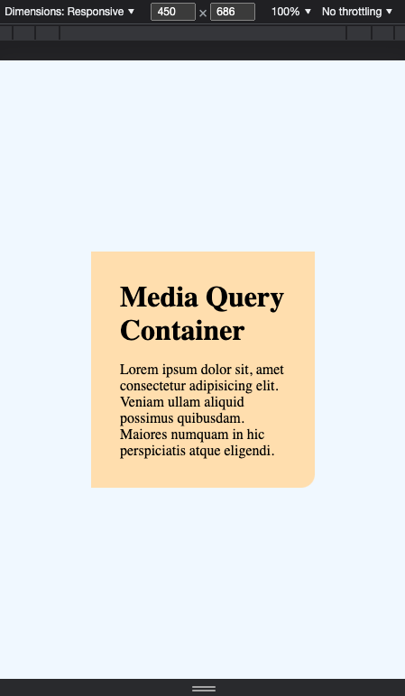
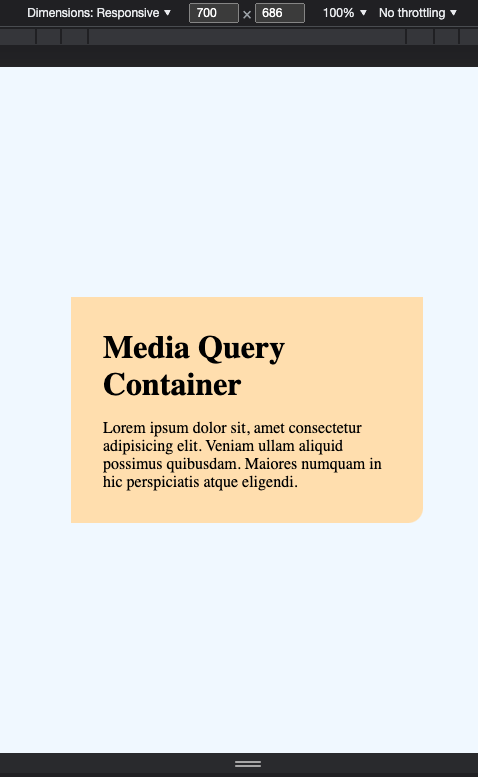
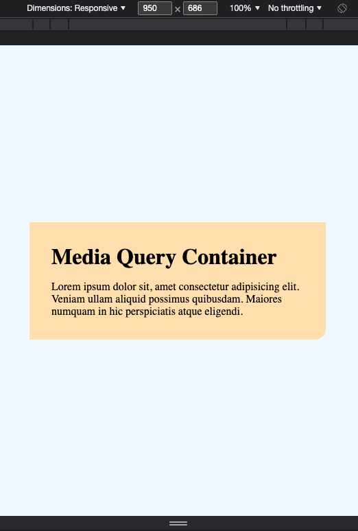
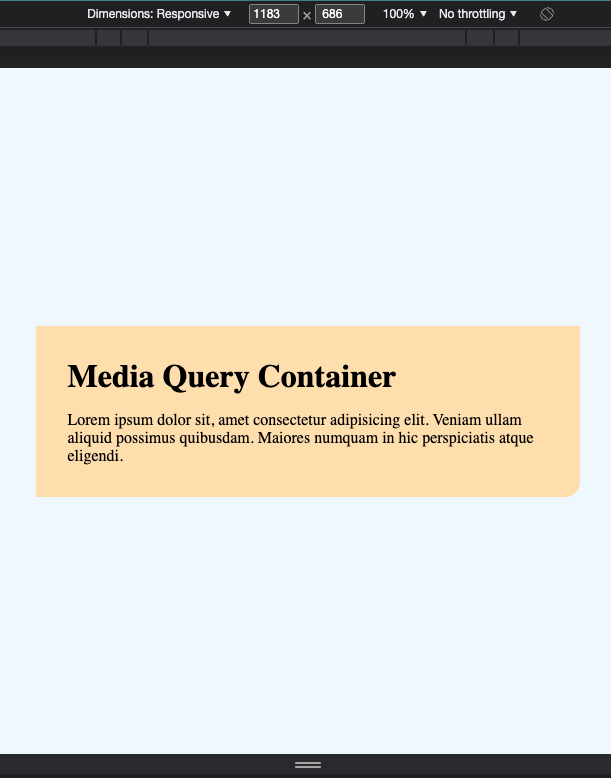

# SIT120 Week 2 Practical Tasks
Cameron Malone - 218344989

## Pass Task 1: Understand Responsive Web Pages and Apps instruction
_Write 1-2 sentences reflections of what responsive design is and why it is important. (Max 150 words)_

### Content:
  Responsive web design is a design paradigm for web applications that revolves around
  creating and developing content in such a way that it 'responds' to changes in
  the users viewing environment, adapting element size and positioning for optimal
  usage regardless of screen size, resolution or orientation. RWD is important in todays
  landscape as mobile devices are becoming more and more popular, meaning the developer
  cannot rely on a consistent desktop viewing experience.

## Pass Task 2: Understanding how responsive web design can be implemented using CSS
_Capture Screenshots and write 1-2 sentence reflection about how to implement responsive web design with CSS; hint: @media rule (Max 150 words)_

### Content: 
  While certain design patterns and page structures can be used in HTML to ease the implementation
  of responsive design, it is most often realised throught the use of CSS. Media queries are an important
  feature of CSS that allow for conditional styling based on screen and viewport properties,
  meaning we can define separate styles for a wide range of use cases. See below for a basic demonstration
  of media query usage:

  Our page consists of a basic card element with a header and some generic text.

  ```html
  <div class="container">
    <h1 id="title"> Media Query Container>
    <p id="main-text"> Lorem ipsum dolor sit, amet...</p>
  </div>
  ```

  In order to make this design responsive, we should like to adjust the width of the container element
  according to the width of the viewport through which the user is accessing the page. 

  ```css
  .container {
      /* persistent styles */
    }

  @media screen and (max-width: 480px) { .container { width: 23ch } }
  @media screen and (min-width: 480px) { .container { width: 36ch } }
  @media screen and (max-width: 768px) { .container { width: 46ch } }
  @media screen and (max-width: 1024px) { .container { width: 60ch } }
  ```

  By using the media queries as above, we can define specific points (known as breakpoints) where we
  wish to adjust the styles of specific elements. The above breakpoint widths follow widely used conventions
  and work well for a wide range of devices ranging from small handheld devices to wide-screen desktop environments.
  Please see the screenshots below for a demonstration of the container width adjustment based on our breakpoints.

  #### Breakpoints
  <div class="container" style="display: flex">
    
    
    
    
  </div>
## Credit Task 3: User Stories and UI/UX design for your project
_Write 2 user stories for web page functions e.g., login function, produce a Figma demo (1 ~ 2 pages). Write 1-2 sentences on why user stories and UI/UX prototypes are important
in responsive web design._

## Distinction Task 4: Use Graphics, media and APIs (Homework)
_In this task you will improve your web page by adding graphics, media and some other APIs such as Canvas,
Audio, video, plugins, Geo-location APIs and drag/drop. You must discuss/demonstrate to your tutor.
**Tasks to Submit**: Develop one page including..._
- Canvas (example a line)
- Video tag
- Audio tag
- Embedded YouTube video

_Capture Screenshots and write 1-2 sentences on the utility of these elements while designing a Responsive
web app._
